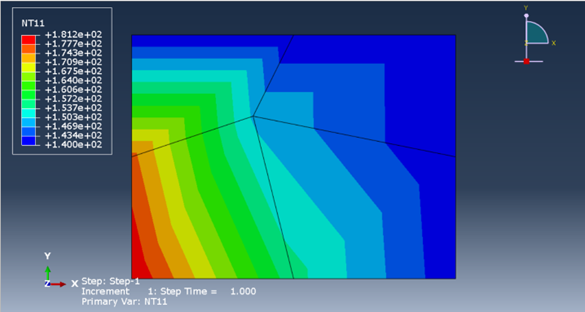
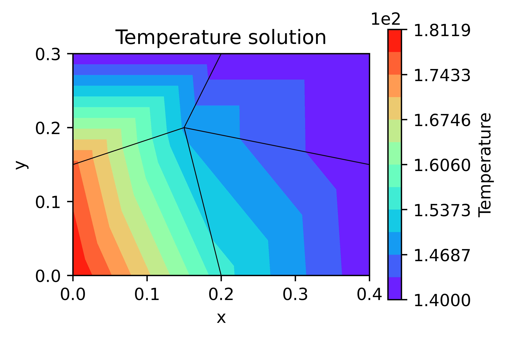
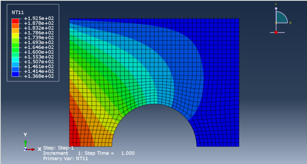
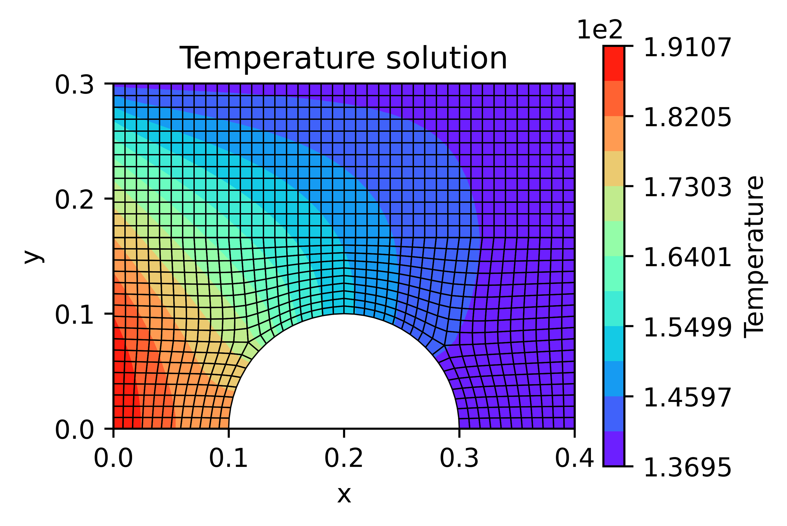

# FEA-Solver

Code cleanup in progress.

This is a hands on project for thermal FEA for 2D files. Only supports DC2D4 elements at the moment.

---

## Comparison of results with Abaqus

### Testing the performance with distorted elements
<table>
  <tr>
    <td align="center" valign="bottom">
       
      <b>Results from Abaqus</b>
    </td>
    <td align="center">
       
      <b>Results from the custom solver in Python</b>
    </td>
  </tr>
</table>

### Results from a higher element count simulation
<table>
  <tr>
    <td align="center" valign="bottom">
       
      <b>Results from Abaqus</b>
    </td>
    <td align="center">
       
      <b>Results from the custom solver in Python</b>
    </td>
  </tr>
</table>

---

## Usage

